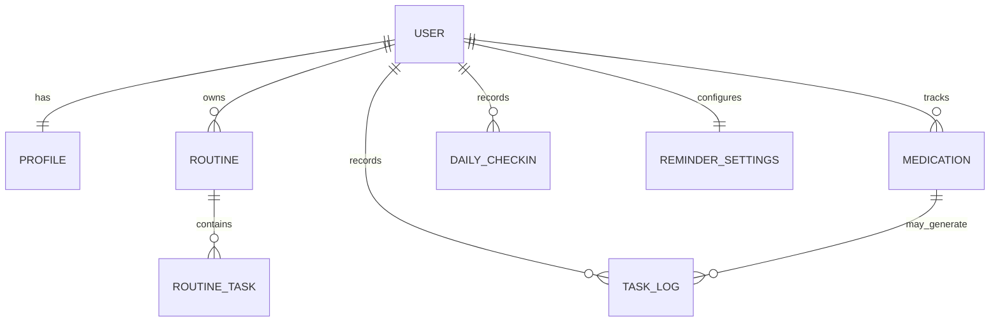

# Saha MVP product architecture

## Requirements and scope

Saha answers one question first: “What should I do right now?” The MVP includes authenticated personal profiles, a day-type-aware routine, medication tracking, reminders and snooze, Jain-vegetarian meal planning, hydration, movement, sleep, a short wellbeing check-in, and non-diagnostic weekly patterns. Recovery mode replaces backlog pressure with the next three essentials when several tasks are missed.

Not in MVP: clinician or caregiver portals, wearable and pharmacy integrations, autonomous schedule changes, medical advice, diagnosis, prescribing, or enterprise organizations.

## Primary user flows

1. Sign in → confirm profile, dietary preferences and weekday schedule → generate an editable routine.
2. Open Today → see one next action → complete, snooze or skip with a reason → continue to the next action.
3. Add medicine from a verified prescription → set its meal dependency and reminders → log taken/skipped without altering clinical instructions.
4. Open Track → record a one-minute check-in → review weekly patterns in Insights.
5. When missed tasks accumulate → enter Recovery Mode → show only medication, next meal and sleep → resume the normal day without penalties.

## Component architecture

- App shell: identity, responsive navigation, notification entry point.
- Today: next-action card, progress, routine timeline, recovery state.
- Plan: day-type schedule and diet-preference-aware meal cards.
- Track: hydration, movement, sleep and wellbeing check-in.
- Medicines: medication records, schedule, log and safety copy.
- Insights: adherence aggregation, wins and optional schedule suggestions.
- Settings/Profile: schedule, dietary rules, reminders, consent, export/delete.

## Data model

The initial D1 schema is in `db/schema.ts`. User ownership is present on every sensitive record, medication instructions remain source data rather than inferred values, and common uniqueness constraints are enforced at the database layer.

## API architecture

Server-side route handlers form a versionable API boundary: `/api/profile`, `/api/today`, `/api/tasks/:id/log`, `/api/medications`, `/api/checkins`, and `/api/insights/weekly`. Every handler resolves the authenticated user on the server, validates ownership, uses prepared database operations, and returns only the minimum required health data. The UI never logs health payloads.

## Reminder architecture

Routine tasks store absolute schedule minutes or an explicit dependency plus offset. A reminder planner materializes the day from its day type (college, weekend, holiday, exam or internship). Delivery is behind a provider interface so in-app notifications can later expand to push, email or approved messaging channels. Escalation observes quiet hours, maximum attempts and acknowledgement; it suggests schedule changes but never silently changes medicine timing.

## Security and future scale

ChatGPT sign-in provides identity for the hosted MVP. Authorization remains server-side. Production extensions should add consent history, audit trails, export/deletion jobs, encryption controls and organization-scoped roles. Condition modules consume the general routine engine; PCOS-specific guidance does not live in the core scheduling domain.
