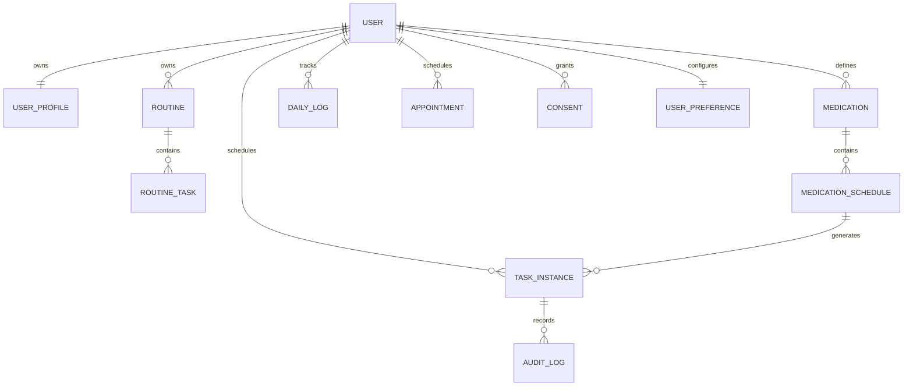

# Personal Health & Routine OS

## Personas and journeys

- A person balancing work and home configures recurring routines and asks what is next.
- A person following clinician-provided instructions records medicines exactly as supplied and tracks adherence.
- A person with variable days selects a routine and recovers gently after interruptions.

First use: sign in → consent → profile/time zone → schedule/meals/preferences/goals → optional medicines → generate day. Daily use: next action → complete/snooze/skip → tracking → review. No profile, condition, diet or medication is inferred.

## MVP and implementation sequence

1. Identity and onboarding. 2. Generic fixed/relative/recurring schedule engine. 3. Date-specific checklist and audit history. 4. User-entered medications and bounded reminders. 5. Meals/hydration/movement. 6. Sleep/wellbeing. 7. Calendar and real-data insights. AI, external push, organizations and wearables are later integrations.

## Architecture

React Native CLI powers the Android/iOS client. Vinext and Cloudflare D1 remain only in the JSON API service. Server-authenticated, user-scoped persistence is separated from pure schedule/analytics logic and presentation. Identity is app-owned email/password registration with JWT bearer sessions stored in native Keychain/Keystore and revocable server-side sessions. Local preview uses an explicitly labeled, nonpersistent sandbox; it cannot access hosted health records.

Core: identity, profile, templates, task instances, events, reminders, preferences, consent. Optional modules: medication, meals, hydration, movement, sleep, wellbeing, appointments. Provider interfaces permit future push/email/SMS and durable background jobs. Notifee queues native reminders for a bounded seven-day window. Reliable renewal without reopening the app needs a background/push provider.

## ER diagram

The initial aggregate persistence boundary stores versioned user-owned JSON with optimistic concurrency; domain types define the future normalized entities. Existing normalized tables are retained. No client-selected user ID is accepted. Task events preserve scheduled time, action time, reason and snooze deadline. Medication source fields are never changed by completion or recovery.

## API contract

`GET /api/routine` → `{state, revision}` or 401. `PUT /api/routine` `{state, revision}` → new revision; 400 invalid data, 409 stale revision. `DELETE /api/routine` deletes only authenticated user's OS aggregate. Every write validates the session, payload bounds and schema; browser requests additionally require same-origin. All responses disable caching. Export is a user-requested JSON snapshot shared using the native share sheet. Consent is required before saving.

## Frontend

A shared typed state powers Today, Builder, Medicines, Meals, Track, Calendar, Insights and Settings. No example medicine or fabricated analytics. Empty states guide setup. Form constraints and server validation both apply. Save errors remain visible; optimistic conflicts do not overwrite another session.

## Schedule and reminder engine

Materialize deterministic date/task IDs from selected routine, recurrence days, date limits and user-entered meal offsets. Relative tasks retain exact offsets, including crossing midnight. Events apply to instances, never medication instructions. Snooze changes only reminder delivery. Recovery displays three pending priorities and creates no replacement medication doses. Notifications use generic text, quiet hours, acknowledgement and bounded escalation; permission is requested by user gesture.

## Security model

The application validates signed JWT cookies and server-side session ownership; it never trusts ChatGPT identity headers. Passwords use per-account salts and PBKDF2-SHA256 (100,000 iterations to fit the Worker WebCrypto limit). A deployment should review password hashing and abuse protection against its operational requirements. Health payloads are excluded from logs. Hosted D1 provides platform encryption at rest; the local SQLite development database is protected by the machine’s filesystem controls. Local development uses HTTP on loopback; any eventual hosted installation must use HTTPS. Consent, no-cache responses, server ownership and bounded validated writes protect the MVP. Production expansion needs operational security review, retention/backups policy, normalized audit storage, durable reminder workers and provider credentials. Password reset, email verification, MFA, OAuth and session-management UI are future work.

## Local project delivery

All changes live in Personal Helper; HealthBuddy/routine-os.jsx supplied reference patterns only. No publication is requested or performed. The retained hosting metadata is existing project configuration and is not required for local sign-in. Vite no longer loads the Sites authentication plugin.

## Actual MVP boundaries

Working: native register/login/logout; per-user saved onboarding and preferences; fixed/relative/weekly/date-bounded tasks; routine selection; medication slot editor; timestamped checklist actions; snooze; bounded native scheduled reminders; meal notes; water/movement/sleep/wellbeing logs; date calendar; weekly task-category insights; recovery display; export and password-confirmed account deletion.

Still to implement: durable closed-app push jobs, dependency-on-completion event tasks, drag-and-drop schedule editing, appointment documents/follow-ups, full monthly/custom-range tracking charts, adaptive suggestion approval flows, optional AI assistant, caregiver/organization roles, password reset/MFA and additional native device integrations. The aggregate model is a migration-friendly MVP boundary rather than the full normalized platform schema.

## React Native CLI conversion
The product UI is in mobile-app/App.tsx and uses native controls. Expo modules were replaced with React Native Keychain, react-native-get-random-values and Notifee. Metro and Babel use React Native configuration. Native android/ and ios/ folders are source files, not disposable build outputs. The API uses bearer sessions for the native client; local database files and secrets are retained during cleanup.
