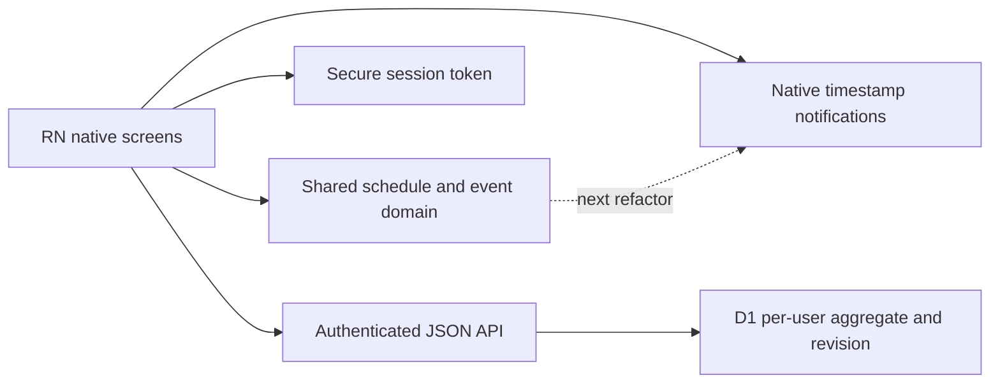

# Personal Helper: repository audit and implementation plan

Audit date: 2026-09-11. Scope: the existing React Native CLI application, shared domain, native configuration, API routes, database definitions/migrations, scripts, documentation and tests. Generated dependencies and private databases/secrets are not application source and were not modified. Findings below describe the pre-change baseline unless marked implemented.

## Architecture actually in use

- Entry: `mobile-app/index.js` registers `SahaNative`; Android `MainActivity.kt` and iOS `AppDelegate.swift` request the same name. React Native 0.86.3, React 19.2.3, CLI 20.1.0. Metro watches `shared/`; Android and CLI commands use port 8082.
- UI: `mobile-app/App.tsx` owns authentication, onboarding, eight tabs (Today, Builder, Medicines, Meals, Track, Calendar, Insights, Settings), editors and application state. Navigation is local tab state, with native modals, not a navigation library. There is no website UI or Expo runtime.
- Domain: `shared/routine.ts` contains version-1 aggregate types, validation, default configuration, generation, recurrence, dated snapshots, event lookup and missed-day closure. The API imports the same validation.
- Notifications: `mobile-app/src/notifications.ts` directly schedules Notifee timestamp triggers. `shared/reminders.ts` contains a separate scan/delivery planner with cooldown and escalation, but the native adapter does not call it. Tests of that planner do not establish native notification reliability.
- Persistence: `mobile-app/src/api.ts` uses bearer JWTs stored by native Keychain/Keystore. Health state lives in memory until an API save succeeds. Preview is explicitly transient. There is no durable local schedule cache or outbox.
- API: Vinext/Cloudflare Worker JSON routes. `POST /api/auth/[action]` implements register, login, logout and password-confirmed account deletion. `GET/PUT/DELETE /api/routine` accesses only the session owner's aggregate. PUT uses revision-based compare-and-swap and returns 409 on conflict.
- Database: active API queries use `accounts`, `sessions`, `auth_attempts`, `routine_states`. `routine_states.state_json` holds tasks, medicines, logs, preferences, consent, snapshots and events. `server/db/schema.ts` also defines older normalized tables against a separate `users` table; current routes do not use these. `scripts/init-db.mjs` bootstraps only migrations 0001 and 0003. Do not blindly normalize or delete old migrations/data.

## Requirement coverage

“Present” means source implementation exists; device acceptance is separate from this audit.

| Requirement areas | Present | Incomplete or absent |
| --- | --- | --- |
| Generalization, onboarding (1–5) | Empty personal name/medicines; optional age; editable time zone, workdays, schedule, dietary restrictions, meal times and numeric goals; consent | Single long form; no module opt-out, explicit holidays or structured goals; onboarding does not include medicine setup before first-day generation |
| Builder, routines (6–7) | Fixed time, meal/wake/sleep offsets, durations, weekdays, start/end dates, priority, reminder switch, custom names; today's routine assignment | No active/inactive task state, dependency on actual event completion, per-date assignment UI beyond today, template management or conflict review |
| Dashboard/checklist (8–9, 12–13) | Next pending task, totals, timeline, timestamped completion/undo/skip/snooze; 5/10/15/30/custom minutes | Flat timeline; overdue tasks sorted before nearer important tasks; no explicit due/upcoming/snoozed-until presentation; terminal tasks still offer snooze/skip |
| Medication (10) | User-entered name, dose, instructions, prescriber, notes, date bounds and multiple independently configured slots | Free text food instructions; no explicit source/version history; no removal confirmation/effective-date policy for slots; recorded same-day details were overwritten on edits |
| Reminders (11–14) | Native permission request, generic lock-screen text, bounded seven-day queue, recurrence, advance, snooze, category filtering, quiet hours, sound/vibration adapter | Cancel-all-first reconciliation; no serialization; native escalation absent despite domain flag; no notification action handler; no durable background renewal; time-zone transition ambiguity |
| Missed/recovery (15–16, 25) | Optional skip reason, materialized prior-day missed records, supportive next-three view; no replacement doses | Midnight closure ignores cross-day snooze; missed count mixes skipped and missed; unopened days lack historical materialization; current-day recovery depends on explicit skip history |
| Meals (17) | Per-date meal text, editable meal timings and optional dietary restrictions including Jain | No ingredients/tags/nutrition entities or structured meal completion; changing a meal time does not update generated fixed meal tasks |
| Hydration/movement (18–19) | Editable target/container, quick-add water, minutes and movement goal; user-created recurring activities | No hydration interval/active hours; no structured activity types or sessions; no per-module enable switch |
| Sleep/wellbeing (20–21) | Bed/wake/duration targets, daily hours, mood/energy/stress, symptoms and notes | Sleep quality absent; no custom metrics/disable; unentered scales default to 3, so future analytics must distinguish unreported from reported |
| Calendar (22) | Month date buttons, previous/next day, dated tasks and water/note summary | No category markers, full tracking summary or appointment-specific documents/follow-ups |
| Insights/score (23–24, 36) | Last seven days' completion bars and category counts from events, explicit non-medical label | No wins/friction/tracking trends, configurable score, date ranges or approval-based adaptive suggestions; unsnapshotted past dates use current templates |
| AI (26) | No AI layer, model call or secret | Defer assistant; establish read-only context and proposal/approval interfaces after occurrence history is reliable; no medical write authority |
| Privacy/data/domain (27–30) | Signed expiring sessions, revocation, user-scoped SQL, bounded payload validation, consent requirement, native share export, account deletion, no health text in notification bodies | No immutable audit store/consent history, role system, retention policy, password reset/MFA, production release signing; aggregate version has no upgrade pipeline |
| UX/empty/errors (31–33) | Native controls, common card/button styles, safe areas, keyboard avoidance, labeled inputs/checkboxes, loading/error messages, no-medicine and no-next-task states | Large single component, horizontal eight-tab navigation, no dark theme, incomplete empty states; numeric fields commit on blur; failed saves and notification errors share a message path |
| Offline/conflicts (34–35) | Optimistic server revision rejects overwrites; failed-save data stays on screen | Restart loses unsaved state; no outbox/retry/conflict resolution; no schedule overlap detection; API lacks timeout/status-specific client handling |
| Tests/workflow (37–43) | 12 baseline domain tests plus API smoke script; RN and API typechecks, Android/iOS JS bundle scripts | No automated native reminder adapter, DST, restart/offline or UI-flow coverage; API smoke uses cookie requests despite its “native” output label |

## Hard-coded assumptions and documentation discrepancies

No current personal medication, diagnosis or condition is required. Jain is an optional choice, not the current app default. Initial wake/sleep/meal targets are editable generic defaults. However, generated movement adds a fixed 30-minute gap after work/commute, wind-down is fixed at 30 minutes before sleep, and default routine selection relies on literal Weekday/Weekend names. These should become explicit user choices. Generated commute/movement/wind-down clock wrapping loses source-day information near midnight.

Historical migration 0000 includes Asia/Kolkata and Jain defaults; migration 0002 changes defaults without rewriting existing preferences. Preserve migration history. Server binding names still contain site-creator labels but serve only the API; renaming could affect local persistence and is not a product priority.

`PRODUCT_ARCHITECTURE.md` previously implied native bounded escalation and retained hosting metadata. Native escalation is not connected, and the current source inventory has no hosting metadata. Its ER diagram is conceptual, not the active physical schema.

## Prioritized implementation plan

| Order | Work and affected boundary | Acceptance evidence |
| --- | --- | --- |
| P0.1 — this increment | Shared history-preserving same-day refresh; wire Builder/task/medication saves to it. Reject duplicate identifiers and fractional offsets. | Regression tests cover completed/skipped/snoozed/undone occurrences, removed slots/routine switches, unchanged past history, editable untouched tasks, future medication changes and malformed identities. All required checks. |
| P0.2 | Consolidate shared planning and Notifee adapter: pure timestamp plan, explicit DST gap/fold policy, serialized/coalesced reconciliation, cancel only stale triggers, preserve valid triggers on failures. | Fake provider failure/concurrency tests; real-device permission, sound, completion, duplicate/restart and queue-limit acceptance. Never silently shift an ambiguous medical time. |
| P0.3 | Occurrence identity includes source date; effective-date review for medication/template changes crossing midnight; preserve and surface cross-day snoozes; explicit historical materialization. | One-time/weekly/start/end recurrence, ±midnight offsets, moved medication source occurrence, late completion, snooze rollover and no extra-dose tests. |
| P0.4 | Separate reminder lifecycle from successful API saves; refresh on account load/foreground. Serialize saves with a trailing save for edits made while a request is pending; handle expiry/conflicts/timeouts. | Deferred-network race tests and native offline completion tests; notification failure must not be reported as lost API data. |
| P1 | Extract screens/forms from App incrementally; editable drafts and field errors, active switch, clear task states, next action/recovery ordering, overlap review, reminder category controls and safe terminal actions. | Native user journey and accessibility checks at large text sizes; every feature configurable/editable/disableable without changing medical instructions. |
| P2 | Guided module-aware onboarding, configurable routine defaults/holidays, structured meal/activity/sleep/wellbeing inputs, hydration intervals; versioned aggregate migration. | Existing user aggregate migration fixtures, optional-module users, time-zone and diverse dietary configurations. |
| P3 | Extract analytics using observed history only; configurable adherence summaries, wins/friction and proposals requiring confirmation. Add read-only assistant context contract. | No fabricated metrics for unlogged days; proposal accept/reject tests; medication source immutable to assistant operations. |
| P4 | Account-scoped encrypted local cache/outbox with operation IDs, retry and revision conflict UX; security/release hardening; normalize only demonstrated query needs. | Restart/offline/online, duplicate replay, account switching/logout/deletion cleanup, ownership and migration tests. |

P0.4 and durable checklist persistence should precede intelligence work even though broader offline capability is listed under P4. Do not replace the backend or introduce a competing schedule engine. No caregiver/organization/wearable implementation is needed in this increment.

## First-increment behavior and limits

Refreshing today's plan preserves the original snapshot of every task that has any recorded action, including an undo or snooze. Edited templates affect untouched tasks today and generated future days. Removed slots or routine switches cannot erase recorded occurrences. The editor explains this policy. Existing events and other date snapshots are retained. This prevents a completed medication's recorded name/dose/instructions/time from changing when its template is edited.

This is not a general event-sourced model or a medical schedule migration policy. Cross-midnight occurrence identity, earlier unsnapshotted history, native reminder reconciliation and offline persistence remain tracked above. Stricter validation rejects malformed legacy aggregates without rewriting them; recovery/import tooling remains future work.

## P0.2 development update

Implemented the shared native timestamp planner in `shared/notification-plan.ts` and connected it to the existing Notifee adapter. Quiet-hours logic is reused from `shared/reminders.ts`; its scan/escalation function remains separate and is not claimed as native escalation.

- All configuration and time resolution happens before native trigger mutation. Missing or repeated daylight-saving wall times are omitted and reported for user review; no medication instruction or task time is rewritten. Absolute snooze deadlines do not require wall-time disambiguation.
- Queue limits are applied after sorting actual delivery instants, including snooze and advance times. Existing notification IDs are retained across rescheduling/restarts.
- Native updates run in FIFO order with a captured state per request; a failed request does not block later requests. Pending requests are serialized rather than coalesced.
- Reconciliation removes only IDs absent from the desired plan and upserts desired IDs. A create failure does not first erase all valid reminders. Listing failure prevents writes; individual cancel/create failures are reported after attempting the remaining operations. OS operations are not transactional: partial updates or a stale trigger after a failed cancellation remain possible and require retry.
- Account-save success is kept distinct from reminder failure in the UI.

Verification: 33 tests pass, including 11 new planner/provider tests for recurrence, date bounds, offsets, advance, quiet hours, caps, completion, stable IDs, DST transitions, failure recovery and serialization. Mobile/API typechecks and Android/iOS JavaScript bundles pass. Native acceptance is still pending: no Android device is connected and the iOS simulator tool is unavailable. Fake-provider tests do not verify OS delivery, sound, vibration or permission behavior.

Next: P0.3 cross-midnight occurrence/snooze correctness, then P0.4 account-load/foreground refresh and save lifecycle. Durable offline storage, closed-app renewal and native escalation remain outstanding. This update supersedes the baseline cancel-all and concurrency findings above; it does not mark the full roadmap complete.

## Verification record

Baseline: `npm test` passed all 12 existing tests before edits. After P0.1 implementation:

- `npm test`: 22/22 passed, including ten new regression cases.
- `npm run typecheck`: passed.
- `npm --prefix server run typecheck`: passed.
- `npm run bundle`: Android and iOS production JavaScript bundles passed (not native binary builds).
- `git diff --check`: passed.
- Native runtime acceptance was not run: `adb devices` returned no connected devices/emulators, and `xcrun simctl` is unavailable in the current Xcode toolchain.
- API integration smoke was not rerun in this increment; only shared validation changed on the API path and it is covered by domain tests and server typecheck.

No secret values or health records are included in this audit. Native acceptance before release: complete a synthetic medication occurrence, edit its time/dose/instructions, confirm today's recorded details persist and tomorrow reflects the edits; repeat with snooze, undo, a removed dose slot and a routine switch. Verify reminder behavior separately under P0.2/P0.3; the domain test results do not establish native delivery reliability.
